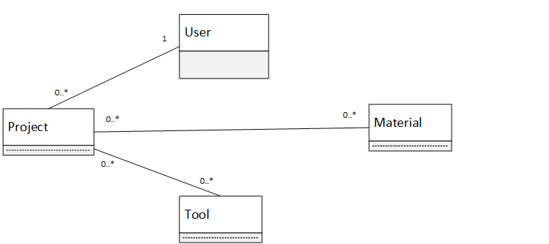
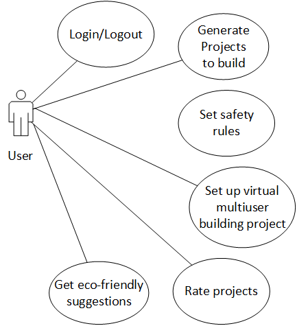

# BuildAbout

BuildAbout is a ML based web application for helping young kids use tools and materials from their surroundings to build virtual or physical projects.

## Motivation

This is our entry to IvyHacks 2020.

## Demo

## How we built it

After multiple brainstorming sessions, we came up with a couple of uml diagrams to model our application.

