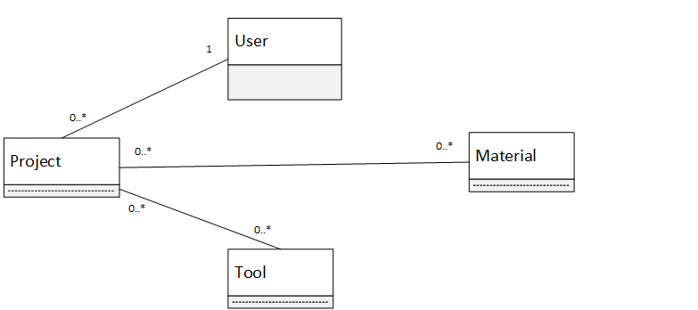
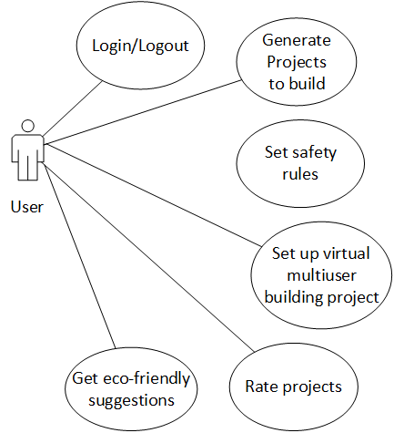

# IvyHacks 2020 (Best Use of Google Cloud - COVID-19 Hackathon Fund)
## TL;DR Why it matters
Kids are spending more time inside than ever before. Inspired by _Antifragile: Things That Gain From Disorder_ by _Nassim Nicholas Taleb_, children need unsupervised play to learn how to deal with anxiety, set-backs, and challenges. With the pandemic, children will now spend less time away from home, unsupervised by their parents or teachers. At its most extreme, children and parents could be confined at home, working and completing school virtually, with very little time apart. ***BuildAbout*** creates the opportunity to give children _unsupervised_ projects, with minimal overhead. ***BuildAbout*** takes as input materials and tools around the house, and instructs on the whole project lifecycle, from preparing your workspace to measuring and cutting materials. The goal of ***BuildAbout*** is to make these unsupervised projects safe, but not _too_ safe. 

## Inspiration
The lack of outdoor play and physical activity among children has always been a growing concern in most communities. The first 7 years of a child’s life are the most crucial stages of brain development and the enhancement of fine motor skills, while the following decade of their life requires intense physical activity on a daily basis. Unfortunately, according to a 2016 study, children in UK were engaged in outdoor play for an average of just 4 hours a week and the COVID-19 lockdown has only made things worse. In this internet-fueled era, children have a tendency to shift to indoor forms of games and entertainment, missing out on physical activities and hands-on skills gained through building projects and repairing household items. Nationwide quarantine is limiting children from both structured and unstructured outdoor play and encouraging the use of screen-based forms of recreation.

Additionally, among the many changes the pandemic has brought in our lifestyles, a significant change is the drastic increase in household waste. Early figures from the most populous Canadian cities, including Vancouver, Calgary and Toronto, reveal that the amount of residential garbage collected has increased by as much as 35% ever since the start of the pandemic. This includes an increase from 14% in 2019 to 17.3% in 2020 of cardboard waste – a material that can be easily reused for household use or for building personal projects.
With a positive mindset and a determination to tackle these challenges during this pandemic, we built our web application, ***BuildAbout***.

## What it does
***BuildAbout*** is a machine-learning-based web application for parents to encourage independence, resourcefulness, and planning in children through personal projects. Designed with an intention of providing ideas to reduce or make use of household waste, ***BuildAbout*** seeks to steer children away from the screen and into the building mindset. Every household good is bought new and thrown away when it breaks. While technological advances have brought many benefits to people around the world, building and repairing the objects we interact with is great for learning and even better for the environment.

***BuildAbout*** allows users to specify the tools and materials they have access to and matches them to relevant projects and activities with the help of a machine learning model. From cooking recipes to science experiments to woodworking DIY projects, ***BuildAbout*** is equipped to work with any field. When searching for projects, users have the option to include ones that use additional tools and materials that are missing from the user’s toolbox, as well as the option to select only projects that utilize eco-friendly materials. Additionally, users also have the ability to post about their own projects, subscribe to projects created and recommended by verified builders, or even get matched with a playdate to collaborate with on a project!

## How we built it
### Backend
We used **Java's Spring Boot** web framework to model our backend. After setting up UML models to better design the logic. We followed a typical layered architecture (Entities, Repositories and Controllers) and we exposed our API via REST Endpoints.

#### UML Models

Class Diagram             |  Use Case Diagram
:-------------------------:|:-------------------------:
  |  

### Frontend
We used **Reactjs** as a frontend framework due to its huge number of available libraries. We also followed a typical Reactjs architecture (components, pages and assets structure), we used the axios package to consume our Java REST Endpoints.

### Machine Learning
In order to find relevant matches for projects according to the tools and materials specified by the user, we incorporated the **Google Cloud Natural Language API** in **Python** to process the content and descriptions of each project, extract its entities (i.e. the objects and tools mentioned), and take into account the salience (i.e. importance or relevance) of that entity in the project description. Accordingly, the Python script calculates a score for each project in the database based on the output of the Natural Language API to rank the matched projects according to relevance.

## Challenges we ran into
Asides from dealing with our varying time zones and balancing school/internship work, we faced the challenge of integrating our cross-platform application, implementing a Java Spring Boot application as the backend, utilizing ReactJS for frontend, and incorporating Python for the machine learning and natural language processing.

## Accomplishes that we’re proud of
As a first/second-time hackathon participants, we are proud of the teamwork we displayed by dividing our work among ourselves according to our specialties while also helping each other with each other’s tasks. Within just short of 4 days we managed to get a fully functioning web application up and running with machine learning integration among the various other features. As genuine altruists, we’re overjoyed to have contributed to a project that has a potential of helping many children develop building skills, as well as reducing residential waste by encouraging the reuse of materials.

## What we learned
Having learned of the different challenges we faced, if we could start all over again, we would surely put greater importance into developing a clearer structure and better planning of the project. Because there were so many different features we wanted to implement, we were, at a time, lost in what to implement first. Additionally, we hadn’t anticipated the challenges we would face trying to build the bridges between all the different platforms we had used. As a note-to-self for the future, we will remember that writing everything under the same or similarly compatible platforms is generally a better idea, even if it means some of us may have to deal with platforms and environments we had never dealt with before.

## What’s next for BuildAbout
While we have been able to develop a fully functioning web application, we would like to implement a lot more features.
In the future we plan to: 
- Include Amazon links to buy materials and tools, 
- Youtube links on project cards to see the building process on video. 
- Implement the Video Call backend logic on the PlayDate page. 
- Add educational lessons and games for children on the Celebrity and WatchExperiments pages.

From an operations perspective, we plan to:
- Deploy this app to GCP, Add CI/CD pipeline to automate the building and deployment process. 
- Expand the user base. 

